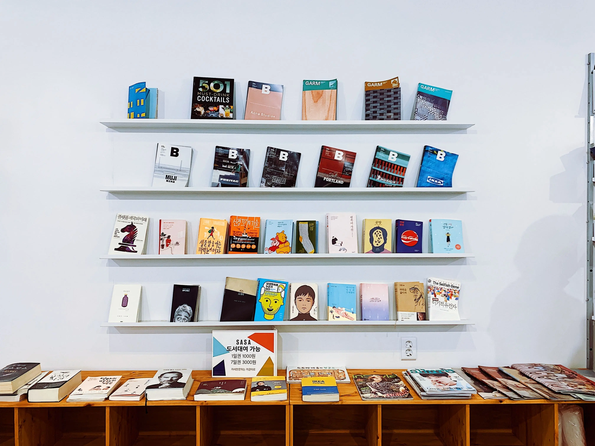

# Créez et publiez votre portfolio de développeur

## Site Access

[**-->here<--**](https://arno37.github.io/Portfolio-OPCR/) 

## Description

My portfolio project is a personal website designed to showcase my skills, projects, and professional journey as a web developer. It serves as a comprehensive platform for presenting my expertise and capabilities to potential employers or clients.

## Project Overview

The portfolio website aims to provide a clear and visually appealing presentation of my background, skills, and projects. It serves as both an informative resource and a demonstration of my technical proficiency through interactive elements and thoughtful design.

## My Role

As the sole developer and designer of this portfolio project, I conceptualized the layout, design, and functionality. I implemented various technologies and ensured a seamless user experience across different devices.

## Data Handling

The portfolio handles data dynamically to display projects, skills, and other relevant information. It fetches data from external APIs and my GitHub repositories to keep the content up to date and reflective of my latest work.

## Technical Constraints

To ensure compatibility and performance, I adhered to responsive design principles and optimized the codebase for speed and efficiency. I also integrated SEO best practices to enhance visibility and accessibility.

## Installation

To view my portfolio locally, simply clone the repository from GitHub and follow the setup instructions provided in the README file.

## Install Dependencies

Before running the portfolio locally, ensure all dependencies are installed by running `npm install` or `yarn install`, depending on your package manager.

## Development

During development, I utilized modern web development technologies such as React.js for frontend interactivity and Node.js for backend functionalities. CSS frameworks like Bootstrap were also employed for styling consistency.

## Contribution

This project reflects my continuous learning and hands-on experience in web development. Contributions, feedback, and suggestions are welcome to improve its functionality and presentation.

## License

These summaries should provide a clear and concise overview of your portfolio project from various aspects, tailored to showcase your skills and achievements effectively.

## <u>2 projets mis en avant:</u>

## <u>Projet 1/ Développement du Back-End du Site Mon Vieux Grimoire</u>

  

#### 1. Courte Description de la Réalisation

Pour le projet "Mon Vieux Grimoire", j'ai développé le back-end du site de notation de livres en utilisant Node.js avec Express pour le serveur, et MongoDB avec Mongoose pour la base de données. J'ai mis en place une architecture MVC pour structurer l'application, implémenté des opérations CRUD pour les livres et les notations, et assuré la sécurité des données avec un système d'authentification sécurisé.

#### 2. Problématiques Rencontrées et Solutions

**Problématiques rencontrées :**

- **Gestion des images volumineuses** : Les utilisateurs pouvaient télécharger des images de grande taille, ce qui aurait pu entraîner des temps de chargement longs et une consommation de ressources élevée.
- **Sécurisation de l'authentification** : Assurer que le système d'authentification soit sécurisé et que les données des utilisateurs soient protégées.
- **Intégration avec le front-end** : Assurer que l'API back-end fonctionne parfaitement avec le front-end développé en React par Kevin.

**Solutions apportées :**

- **Optimisation des images** : Utilisation du package Sharp pour redimensionner et compresser les images téléchargées, réduisant ainsi leur taille tout en maintenant une bonne qualité visuelle.
- **Système d'authentification sécurisé** : Implémentation de l'authentification avec JWT (JSON Web Tokens) et bcrypt pour hacher les mots de passe, garantissant ainsi la sécurité des données des utilisateurs.
- **Tests et validation** : J'ai effectué des tests rigoureux et des points de contrôle réguliers avec Kevin pour m'assurer que l'intégration entre le back-end et le front-end se passe sans accroc.

#### 3. Compétences Développées

➜ **Développement de serveurs avec Express** : Amélioration de ma capacité à créer et structurer des serveurs Node.js avec Express, en suivant une architecture MVC.

➜ **Utilisation de MongoDB et Mongoose** : Approfondissement de mes compétences en modélisation de données avec Mongoose et en gestion de bases de données MongoDB.

➜ **Sécurité des applications web** : Renforcement de mes connaissances en implémentation de systèmes d'authentification sécurisés avec JWT et bcrypt.

➜ **Optimisation des ressources web** : Acquisition d'une meilleure compréhension des techniques d'optimisation des images pour améliorer les performances.

### Lien

- **Lien vers le repo GitHub du code back-end** : [GitHub Repo](https://github.com/Arno37/Mon_Vieux_Grimoire)

## <u>Projet 2/ Développement du Front-End de l'Application avec React</u>

  

#### 1. Courte Description de la Réalisation

Dans ce projet, j'ai implémenté le front-end d'une application en utilisant React et React Router. En partant de Create React App, j'ai configuré l'application initiale et développé les différents composants d'interface utilisateur selon les maquettes fournies sur Figma.

#### 2. Problématiques Rencontrées et Solutions

**Problématiques rencontrées :**

- **Intégration des animations et des composants interactifs** : Assurer que les composants tels que la galerie d'images (Gallery) et les menus déroulants (Collapse) fonctionnent correctement.
- **Gestion des images dans la galerie** : Faire en sorte que la navigation dans la galerie soit circulaire et que les boutons de navigation disparaissent si une seule image est présente.
- **Respect des dimensions de la galerie** : Maintenir une hauteur constante pour la galerie et centrer les images, même lorsqu'elles sont redimensionnées.

**Solutions apportées :**

- **Utilisation de prototypes Figma** : Les prototypes Figma ont été utilisés pour comprendre et implémenter les animations et comportements interactifs attendus.
- **Logique de navigation circulaire** : Pour la galerie, j'ai implémenté une logique permettant de revenir à la première image depuis la dernière et inversement, en utilisant des conditions dans le composant Gallery.
- **Style CSS et propriétés flexbox** : Pour maintenir une hauteur constante et centrer les images dans la galerie, j'ai utilisé des propriétés CSS telles que `object-fit` et des conteneurs flexbox.

#### 3. Compétences Développées

➜ **Développement d'interfaces utilisateur avec React** : Approfondissement de mes connaissances en développement de composants React, en gestion de l'état et des props, ainsi qu'en application des meilleures pratiques de conception d'interfaces utilisateur.

➜ **Routage avec React Router** : Acquisition d'une meilleure compréhension de la configuration et de la gestion du routage dans une application React, permettant une navigation fluide entre les différentes pages.

➜ **Intégration de maquettes Figma** : Amélioration de mes compétences en intégration de maquettes de design, en exportant et utilisant les ressources Figma.

➜ **Optimisation des composants interactifs** : Développement des compétences dans la création et l'optimisation de composants interactifs, tels que les galeries d'images et les menus déroulants, en assurant qu'ils fonctionnent selon les attentes et de manière performante.

### Liens

➜ **Lien vers le site** : [website](https://arno37.github.io/Kasa/)
➜ **Lien vers le repo GitHub** : [GitHub Repo](https://github.com/Arno37/Kasa)
